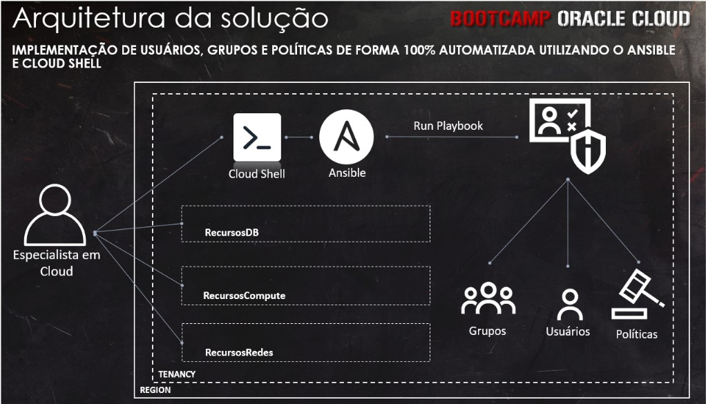
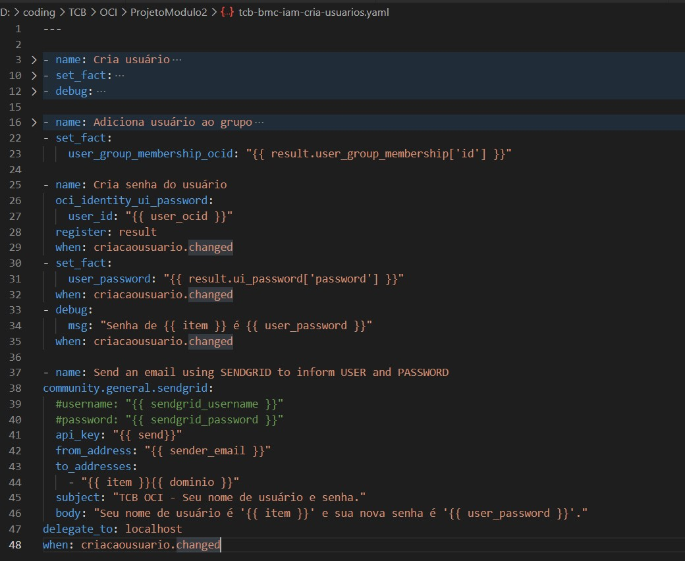
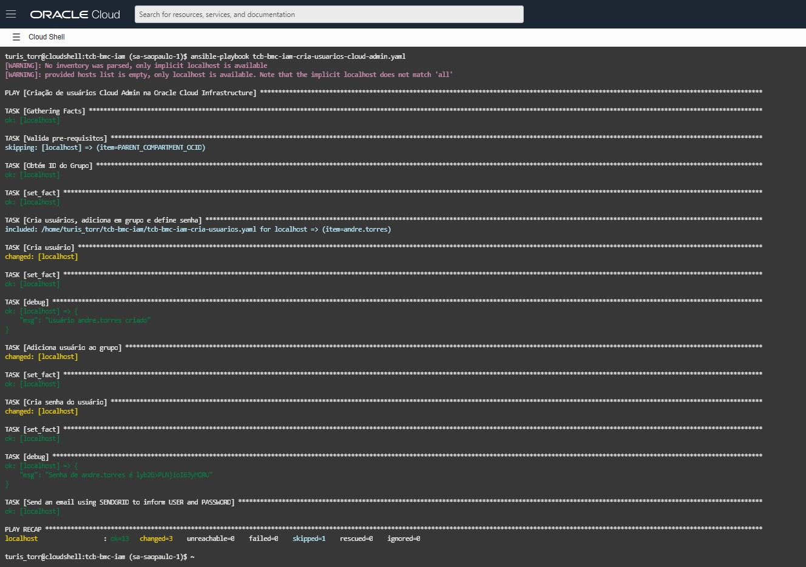

# Ansible OCI IAM automation

## Creation of Users, Groups, and Policies on OCI using Ansible
&nbsp;

<figcaption>The proposition</figcaption>

---
&nbsp;

<figcaption>Ansible playbook</figcaption>

---
&nbsp;

<figcaption>Ansible Running</figcaption>

&nbsp;